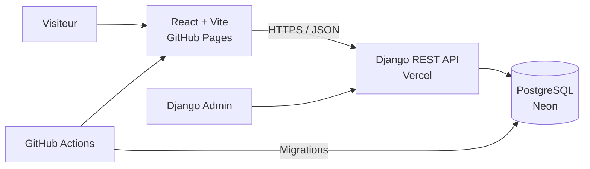

<div align="center">

# Portfolio — Ibrahim Rahmani

Portfolio Full Stack moderne pour présenter mes compétences, mes projets et mes articles techniques.

[](https://github.com/ibrahimrh555/Portfolio_Ibrahim_Rahmani/actions/workflows/deploy.yml)
[](https://react.dev/)
[](https://www.djangoproject.com/)
[](https://neon.tech/)

[Voir le portfolio](https://ibrahimrh555.github.io/Portfolio_Ibrahim_Rahmani/) ·
[Explorer l’API](https://portfolio-ibrahim-rahmani-ten.vercel.app/api/) ·
[Signaler un problème](https://github.com/ibrahimrh555/Portfolio_Ibrahim_Rahmani/issues)

</div>

---

## À propos

Ce dépôt contient le frontend React et le backend Django de mon portfolio personnel. Les projets et les articles ne sont pas intégrés statiquement dans l’interface : ils sont administrés avec Django Admin, enregistrés dans PostgreSQL sur Neon, exposés par une API REST, puis chargés par le frontend.

Le portfolio met notamment en valeur des réalisations Full Stack, mobiles, backend et IoT, dont **10in**, une application sociale dédiée au football amateur.

## Fonctionnalités

- Présentation du profil, des compétences et des expériences
- Catalogue dynamique de projets
- Blog avec catégories, tags et articles à la une
- Pages de détail accessibles par slug
- Administration sécurisée avec Django Admin
- API REST publique en lecture seule
- Interface responsive avec thèmes clair et sombre
- Gestion des états de chargement, d’erreur et de contenu vide
- Déploiement continu depuis la branche `main`
- Migration de la base Neon avec un workflow manuel sécurisé

## Architecture



| Couche | Technologies | Hébergement |
|---|---|---|
| Frontend | React 18, TypeScript, Vite, Tailwind CSS, shadcn/ui | GitHub Pages |
| Backend | Django 5.2, Django REST Framework, WhiteNoise | Vercel |
| Base de données | PostgreSQL | Neon |
| Automatisation | GitHub Actions | GitHub |
| Interface d’administration | Django Admin | Vercel |

## Structure du dépôt

```text
Portfolio_Ibrahim_Rahmani/
├── .github/workflows/
│   ├── deploy.yml           # Validation et déploiement GitHub Pages
│   └── database.yml         # Migrations Neon et création de l’admin
├── backend/
│   ├── api/index.py         # Entrée WSGI pour Vercel
│   ├── content/             # Modèles, API, serializers et migrations
│   ├── portfolio_api/       # Configuration Django
│   ├── manage.py
│   ├── requirements.txt
│   └── vercel.json
├── public/                  # Ressources publiques
├── src/
│   ├── components/          # Composants React réutilisables
│   ├── hooks/               # Hooks personnalisés
│   ├── lib/api.ts           # Client de l’API Django
│   └── pages/               # Pages du portfolio
├── .env.example
├── package.json
└── vite.config.ts
```

## Installation locale

### Prérequis

- Node.js 22 recommandé
- npm
- Python 3.13 recommandé
- Git

### 1. Cloner le dépôt

```bash
git clone https://github.com/ibrahimrh555/Portfolio_Ibrahim_Rahmani.git
cd Portfolio_Ibrahim_Rahmani
```

### 2. Configurer le backend

```bash
cd backend
python -m venv .venv
```

Activation de l’environnement virtuel :

```powershell
# Windows PowerShell
.venv\Scripts\Activate.ps1
```

```bash
# Linux ou macOS
source .venv/bin/activate
```

Installer les dépendances et préparer Django :

```bash
pip install -r requirements.txt
cp .env.example .env
python manage.py migrate
python manage.py createsuperuser
python manage.py runserver
```

Le backend sera disponible sur :

- API : [http://127.0.0.1:8000/api/](http://127.0.0.1:8000/api/)
- Administration : [http://127.0.0.1:8000/admin/](http://127.0.0.1:8000/admin/)

### 3. Configurer le frontend

Dans un second terminal, depuis la racine du projet :

```bash
npm ci
cp .env.example .env
npm run dev
```

Le frontend sera accessible sur [http://localhost:5173](http://localhost:5173).

## Variables d’environnement

### Frontend

```env
VITE_API_URL=http://127.0.0.1:8000/api
```

### Backend

```env
SECRET_KEY=replace-with-a-long-random-secret
DEBUG=True
ALLOWED_HOSTS=localhost,127.0.0.1
DATABASE_URL=sqlite:///db.sqlite3
CORS_ALLOWED_ORIGINS=http://localhost:5173
CSRF_TRUSTED_ORIGINS=http://localhost:5173
```

En production, `DATABASE_URL` doit contenir la chaîne PostgreSQL fournie par Neon avec `sslmode=require`.

> Ne publiez jamais `SECRET_KEY`, `DATABASE_URL` ou un mot de passe dans Git.

## API

| Méthode | Endpoint | Description |
|---|---|---|
| `GET` | `/api/` | Racine et liens de l’API |
| `GET` | `/api/projects/` | Liste des projets publiés |
| `GET` | `/api/projects/{slug}/` | Détail d’un projet |
| `GET` | `/api/posts/` | Liste des articles publiés |
| `GET` | `/api/posts/{slug}/` | Détail d’un article |
| `GET` | `/api/categories/` | Liste des catégories |
| — | `/admin/` | Administration Django |

Les endpoints publics sont volontairement en lecture seule. La création et la modification du contenu passent par Django Admin.

## Scripts utiles

| Commande | Description |
|---|---|
| `npm run dev` | Lance Vite en développement |
| `npm run build` | Génère le build de production |
| `npm run preview` | Prévisualise le build |
| `npm run lint` | Analyse la qualité du frontend |
| `python manage.py test` | Exécute les tests Django |
| `python manage.py migrate` | Applique les migrations |
| `python manage.py createsuperuser` | Crée un administrateur |

## Déploiement

| Composant | Service | Déclenchement |
|---|---|---|
| Frontend | GitHub Pages | Push ou merge sur `main` |
| Backend | Vercel | Push ou merge sur `main` |
| Migrations | GitHub Actions | Lancement manuel |
| Base de données | Neon | Accessible par Django |

La variable GitHub Actions suivante relie le frontend au backend :

```text
VITE_API_URL=https://portfolio-ibrahim-rahmani-ten.vercel.app/api
```

Les secrets utilisés par le workflow de migration sont :

```text
NEON_DATABASE_URL
DJANGO_SECRET_KEY
DJANGO_SUPERUSER_USERNAME
DJANGO_SUPERUSER_EMAIL
DJANGO_SUPERUSER_PASSWORD
```

Les valeurs sensibles ne doivent jamais être ajoutées au dépôt.

Pour les instructions détaillées du backend, consultez [backend/README.md](backend/README.md).

## CI/CD

Le workflow `Validate and deploy portfolio` :

1. installe les dépendances frontend ;
2. exécute ESLint ;
3. génère le build Vite ;
4. vérifie les migrations Django ;
5. exécute les tests backend ;
6. déploie le frontend sur GitHub Pages si les validations réussissent.

Le workflow `Migrate Neon database` applique les migrations Django et crée éventuellement le superutilisateur configuré dans les secrets GitHub.

## Versions et releases

Le projet utilise le versionnement sémantique :

```text
v1.0.0  Première version stable
v1.0.1  Correction de bug
v1.1.0  Nouvelle fonctionnalité compatible
v2.0.0  Évolution majeure
```

Les versions publiées sont disponibles dans la section [Releases](https://github.com/ibrahimrh555/Portfolio_Ibrahim_Rahmani/releases).

## Contact

**Ibrahim Rahmani**

- GitHub : [@ibrahimrh555](https://github.com/ibrahimrh555)

---

<div align="center">
Développé avec React, Django et PostgreSQL.
</div>
